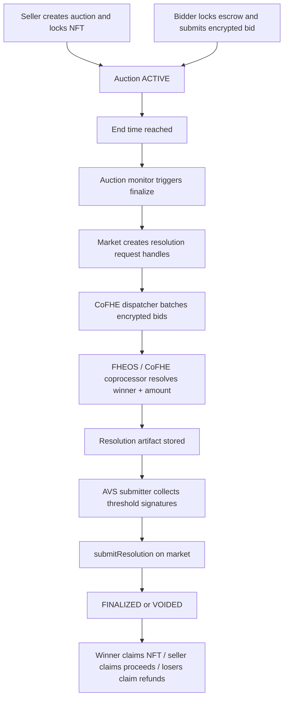

# Async CoFHE Settlement Flow

## Notes

- The market never exposes plaintext bids on-chain.
- `triggerFinalize` creates the request identity and binds it to the market address.
- CoFHE dispatch batches are bounded to reduce keeper-side overload.
- AVS signatures are verified against the market address and request identifier before finalization is accepted.
- Fallback void logic remains available when the async path exceeds the dynamic timeout window.
