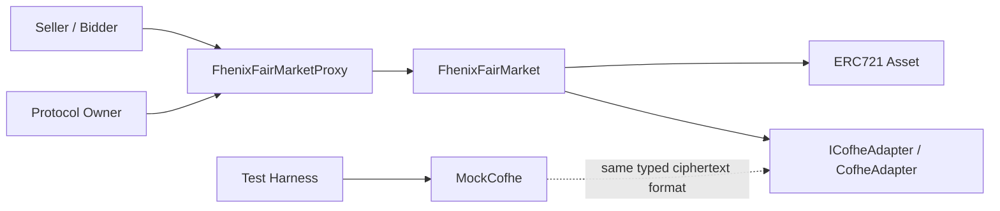
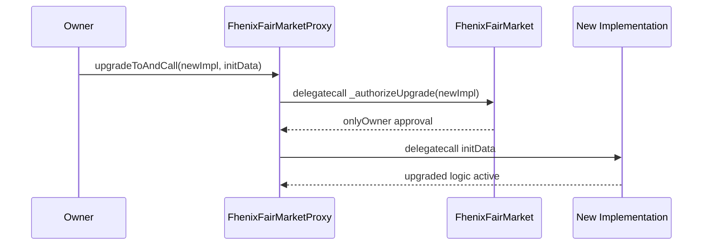
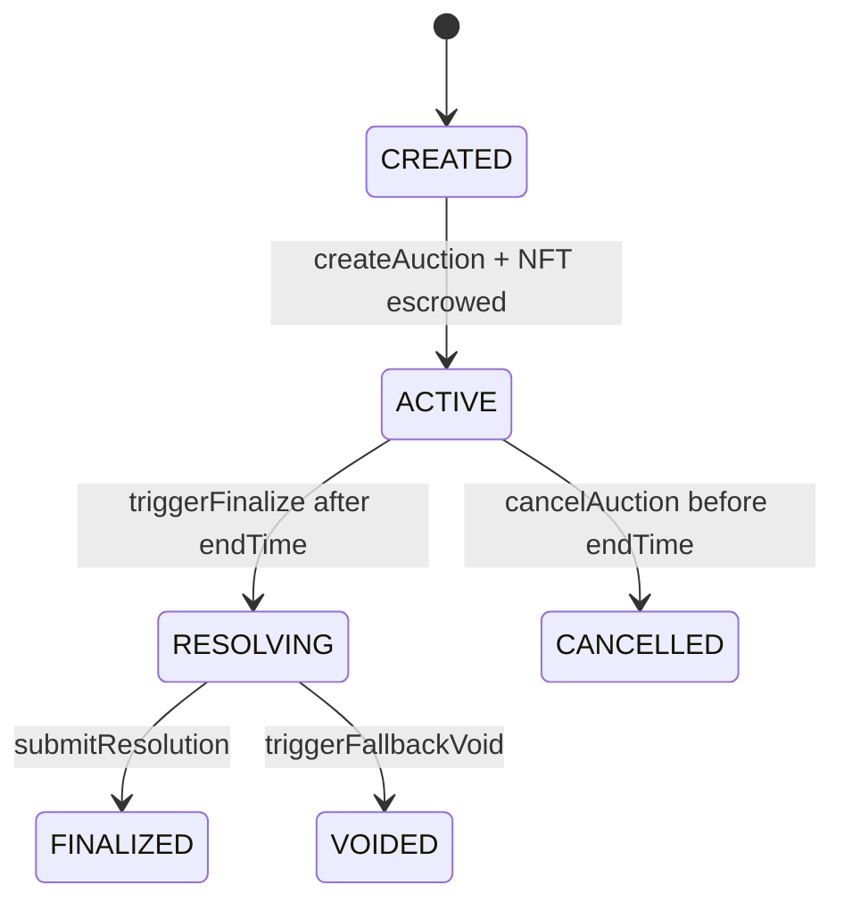

# Phase 1 Architecture Review

This document closes the remaining architectural work for Phase 1 of `Fhenix-FairMarket`.

## Contract Topology

## Roles and Responsibilities

- `FhenixFairMarketProxy` preserves a stable contract address while delegating logic to the upgradeable implementation.
- `FhenixFairMarket` owns the auction lifecycle, escrow bookkeeping, seller cancellation, owner fallback-void, and resolution recording.
- `ICofheAdapter` is the only boundary through which the core contract should consume CoFHE-style encrypted operations.
- `CofheAdapter` currently supplies deterministic typed ciphertext helpers for local development until production CoFHE contracts are wired in later phases.
- `MockCofhe` mirrors the adapter surface and adds plaintext assertions for local tests.

## Upgrade Path

### UUPS Security Notes

- Initialization replaces constructor logic and locks ownership at deployment time.
- `_authorizeUpgrade()` is owner-gated.
- The proxy remains thin and uses `ERC1967Proxy`, keeping upgrade logic inside the implementation where it can be audited with the contract code.
- The test suite validates both successful owner-driven upgrades and unauthorized upgrade rejections.

## Auction State Machine

## Encrypted Boundary

- Phase 1 deliberately avoids direct imports from production FHE contracts inside the market core.
- Typed ciphertext handles currently cover:
  - `euint32`
  - `ebool`
- Supported deterministic helper operations in the local adapter/mock path:
  - `asEuint32`
  - `asEbool`
  - `lte`
  - `gt`
  - `select`
  - `verifyEncryptedBidCoverage`
  - `seal`

## Validation Artifacts

- Unit tests cover initialization, UUPS authorization, auction creation, escrow locking, state transitions, cancellation, fallback-void, and adapter/mock behavior.
- Integration tests cover end-to-end proxy deployment, auction creation, escrow funding, encrypted bid-coverage checks, and owner resolution submission.
- Coverage remains above the Phase 1 target (`>= 70%` branch coverage).
