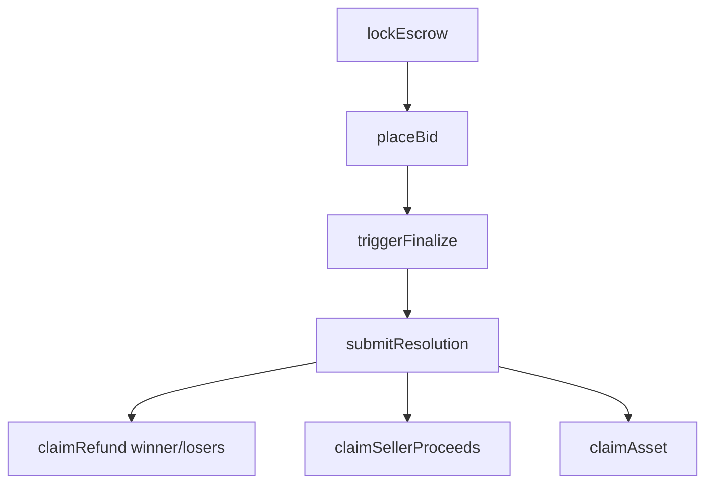
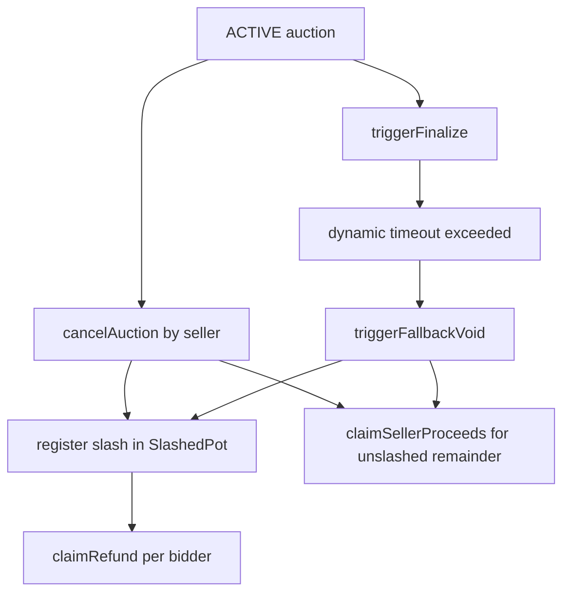

# Phase 2: Security & Settlement

This phase upgrades the market from a documentation-first escrow flow into a settlement-aware auction core.

## What changed

- `placeBid()` now stores encrypted bid handles in `O(1)` and rejects bids that exceed the caller's escrow via `ICofheAdapter.lte(...)`.
- `claimRefund()` follows a strict pull-over-push model. Each participant withdraws their own refund, and there are no payout loops in the market contract.
- `SettlementEngine.sol` centralizes dynamic timeout, seller slashing, seller payout, and pro-rata compensation math.
- `SlashedPot.sol` receives seller penalties on `CANCELLED` and `VOIDED` paths, then releases compensation per bidder on demand.
- `triggerFallbackVoid()` now enforces a moving timeout window instead of an immediate owner-only void. Long idle auction periods are excluded from the network average so normal auction duration does not inflate the emergency threshold.
- Final settlement became two-step and explicit:
  - seller claims proceeds with `claimSellerProceeds()`
  - winner claims the locked NFT with `claimAsset()`

## Architectural flow

## Cancellation and fallback flow

## Audit-oriented invariants

- No `for` or `while` loops in refund or compensation paths.
- Plain bid amounts are not emitted in bid or resolution events.
- Seller penalties are escrow-backed and never mint synthetic compensation.
- Fallback only opens after a dynamic threshold derived from observed short-interval network activity.
- NFT custody remains locked in escrow until one of these terminal outcomes:
  - returned to seller on `CANCELLED`
  - returned to seller on `VOIDED`
  - claimed by winner or seller after `FINALIZED`

## Validation

- `AsyncResolution.test.ts` covers encrypted solvency, pull-based refunds, seller proceeds, and slashed-pot compensation.
- `DynamicTimeout.test.ts` covers a 30-minute sequencer outage and a congested network profile with a higher timeout ceiling.
